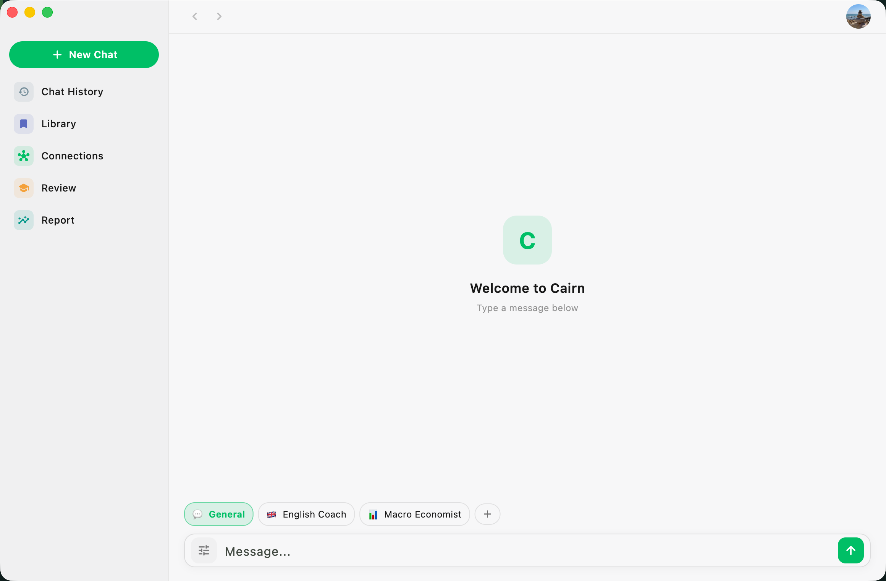
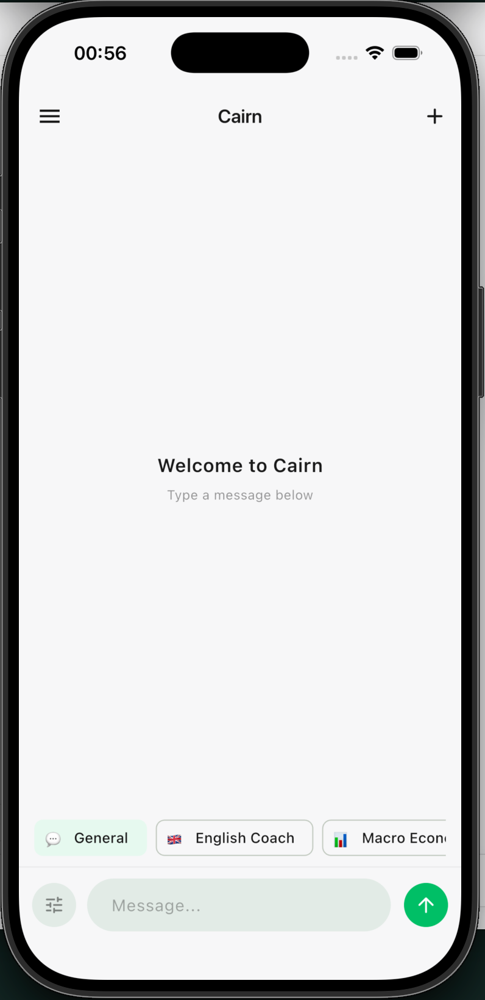

# Cairn

> _Stack your knowledge, one stone at a time._

Cairn is an AI-native knowledge companion. Chat with any LLM, save what
turns out to be worth keeping, and let the model reason over your
library the next time you ask it something. Notes graduate into a
spaced-repetition review queue so what you learn actually sticks.

Runs natively on macOS, iOS and Android from a single Flutter codebase.

> **100% on-device. No backend.** Cairn has no server of its own. Your
> notes, conversations, tags, embeddings, and API keys live only in a
> local SQLite database on your machine. The only network traffic is
> the LLM / embedding requests you configure — sent directly from your
> device to whichever provider you picked (OpenAI, Anthropic, or any
> endpoint you paste in). Nothing routes through us, because there is
> no "us".

---

## What makes it different from a notes app

| Plain notes | Cairn |
|-|-|
| You save. You search. | You save. The model retrieves. |
| Tags are typed by hand. | Tags are generated by the model. |
| Review = re-read. | Review = spaced repetition (FSRS). |
| Notes are dead files. | Notes feed the chat — cross-conversation recall via embeddings. |

The LLM can call library-aware tools (`get_stats`, `get_tag_distribution`,
`get_recent`, `get_by_tag`, `sample_random`, `get_note_detail`,
`get_tag_trend`) to read your saved knowledge on demand — so asking
"what kind of person am I?" actually pulls from what you've written.

## Features

- **Multi-provider chat** — OpenAI, Anthropic, and any OpenAI-compatible
  endpoint (including local models via a custom base URL).
- **Auto-captured knowledge** — assistant replies with a `cairn-meta`
  block are auto-indexed for later recall, without cluttering the
  Library page.
- **Semantic recall** — embeddings feed the chat's system prompt with
  relevant past notes, so context travels across conversations.
- **Tag graph & Connections** — surfaces clusters of related notes.
- **Spaced-repetition review** — FSRS scheduling, with a due-count
  badge on the nav.
- **Knowledge report** — AI summary of what you've been collecting.
- **Three-pane desktop shell** on macOS; drawer-based layout on mobile.
- **Three themes** (Light, Pink, Dark) with cohesive surface palettes
  and a shared semantic nav-accent system.
- **No backend, no telemetry** — SQLite (Drift) on-device is the
  single source of truth. The only outbound traffic is your own LLM /
  embedding requests, going directly from your device to the provider
  you configured. Your data never passes through a server we control,
  because we don't run one.
- **Share-intent capture** on iOS/Android — save URLs and text from
  any app into the library.
- **Local dictionary** — compact ECDICT for in-chat word lookup.

## Platforms

| Platform | Status |
|-|-|
| macOS    | Primary development target (three-pane shell) |
| iOS      | Supported (drawer shell, share-intent) |
| Android  | Supported (drawer shell, share-intent) |
| Web / Windows / Linux | Not currently targeted |

## Getting started

```bash
flutter pub get
dart run build_runner build --delete-conflicting-outputs   # drift codegen
flutter run                                                # pick a device
```

On first launch you'll walk through an onboarding flow: pick a
language, configure an optional HTTP proxy, choose a provider, paste
an API key, and pick a default model. Nothing leaves the device until
you've entered a key.

### Running on macOS

The desktop window resizes itself between the onboarding card (560×720)
and the three-pane chat shell (1160×760). This is driven by a method
channel defined in `macos/Runner/MainFlutterWindow.swift`.

## Architecture

- **UI** — Flutter + Material 3. Pages under `lib/pages`, shared
  widgets under `lib/widgets`.
- **State** — `provider`-based; see `chat_provider.dart`,
  `library_provider.dart`, `review_provider.dart`, etc.
- **Persistence** — Drift (SQLite) at `lib/services/db/database.dart`.
  Schema versioning is explicit; migrations live alongside the tables.
- **LLM providers** — pluggable abstraction in `lib/services/llm`.
  Anthropic and OpenAI-shaped APIs are wired; adding a new provider
  means implementing one class.
- **Tools / function calling** — `lib/services/tools`. Each tool
  declares its JSON schema and executes in isolation; `ToolExecutor`
  dispatches parallel `tool_use` blocks via `Future.wait`.
- **Embeddings** — local codec + fan-out queue in
  `lib/services/embedding_*`. Health monitor falls back to keyword
  recall when providers misbehave.
- **Review** — FSRS fields on `saved_items`; scheduler in
  `review_provider.dart`.

## Code hygiene

`flutter analyze` must be clean on every commit. See `CLAUDE.md` for
the full rules (no silenced warnings, no deprecation drift, etc.).

## Status

Personal project; APIs and schema change without notice. If the Drift
generated file gets out of sync, run:

```bash
dart run build_runner build --delete-conflicting-outputs
```

## License

TBD.

---

## Screenshots

<p align="center">
  
  <br />
  <em>Three-pane desktop shell on macOS.</em>
</p>

<p align="center">
  
  <br />
  <em>Drawer-based shell on iOS.</em>
</p>
